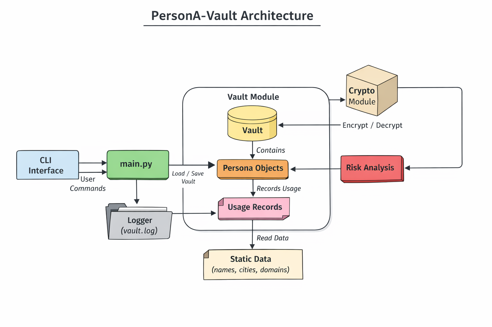

# PersonA-Vault

**Secure Digital Persona Management for Security Professionals**


## Overview

**PersonA-Vault** is a secure, command-line-driven vault engineered for structured digital identity compartmentalization.

It is designed for security professionals, ethical hackers, researchers, and privacy-conscious operators who require strict separation between personas, controlled activity logging, and measurable exposure risk.

The system enforces encryption, auditability, and lifecycle control — ensuring that sensitive persona data remains protected, traceable, and operationally contained.

This is not a password manager.
It is an operational security tool.


## Core Capabilities

* **Persona Lifecycle Management**
  Create, modify, retire, or permanently burn digital personas.

* **Structured Usage Logging**
  Track activity with timestamps, platforms, context notes, and tags.

* **Dynamic Risk Scoring Engine**
  Evaluate exposure levels based on usage frequency, status, and activity history.

* **Compartmentalized Data Model**
  Isolated persona objects with controlled state transitions.

* **Encrypted Vault Storage**
  Data encrypted at rest with master password protection.

* **Audit Trail & Accountability**
  All state-changing actions are logged.

* **CLI-First Architecture**
  Lightweight, dependency-minimal, automation-friendly, and scriptable.


## Architecture

<p align="center">
  <a href="assets/personavault_architecture.png">
    
  </a>
</p>

### System Design Principles

PersonA-Vault follows a modular architecture built around separation of concerns:

* **CLI Layer** — Entry point for user interaction
* **Core Vault Engine** — Persona state management and lifecycle control
* **Crypto Module** — Encryption and secure data persistence
* **Risk Engine** — Exposure analysis logic
* **Logging Module** — Immutable activity trail

All interactions pass through the CLI into `main.py`, which coordinates internal modules while preserving isolation between responsibilities.

This architecture reduces attack surface, improves maintainability, and enforces strict operational boundaries between personas.


## Threat Model

PersonA-Vault is designed under the assumption that:

* The operator may manage multiple high-risk or sensitive personas.
* Exposure correlation between identities must be minimized.
* Local device compromise is possible, therefore encryption at rest is mandatory.
* Operational mistakes (reuse, overexposure, inactivity mismanagement) increase risk over time.

### Security Objectives

* Prevent cross-persona linkage through structured compartmentalization.
* Protect vault data against unauthorized local access.
* Maintain audit visibility of persona lifecycle events.
* Provide measurable risk feedback to inform operational decisions.

PersonA-Vault does **not**:

* Protect against full system compromise.
* Replace hardened operating system practices.
* Eliminate human error.

It reduces risk through structure and discipline — not illusion.


## Installation

### Requirements

* Python 3.11+
* Virtual environment recommended

```bash
# Optional: create a virtual environment
python3 -m venv venv
source venv/bin/activate

# Install dependencies
pip install -r requirements.txt
```


## Usage

### Initialize Vault

```bash
python -m personavault.main init
```

### Unlock Vault

```bash
python -m personavault.main unlock
```

### Create Persona

```bash
python -m personavault.main new
```

### List Personas

```bash
python -m personavault.main lst
```

### View Persona Details

```bash
python -m personavault.main view
```

### Burn or Retire Persona

```bash
python -m personavault.main burn
python -m personavault.main retire
```

### Search by Tag or Status

```bash
python -m personavault.main search --tag darkweb --status active
```

### Export or Backup Vault

```bash
python -m personavault.main export
python -m personavault.main backup
```

### Risk Assessment

```bash
python -m personavault.main risk
```

### Full Command Reference

```bash
python -m personavault.main --help
```


## Security & Data Handling

* Vault data encrypted at rest.
* Master password required for unlock and export.
* Structured persona state transitions (active → retired → burned).
* Immutable logging of high-impact operations.
* Designed around compartmentalization principles to minimize identity bleed-over.

Security is enforced by design, not by convention.


## Roadmap

* Optional GUI interface (without weakening CLI foundation)
* Automated testing suite
* CI/CD integration
* Enhanced analytics and reporting engine
* Vault integrity verification mechanisms
* Configurable risk scoring model


## License

MIT License

Open-source and contribution-friendly.
All contributions must preserve architectural integrity and security posture.


