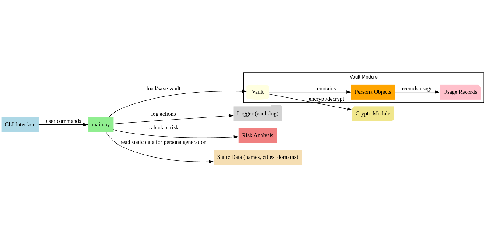

# PersonA-Vault  
**Elite Digital Persona Management for Security Professionals**  

---

## **Overview**  
PersonA-Vault is a secure, command-line-driven vault designed to manage, track, and protect multiple digital personas. It enables security professionals, ethical hackers, and privacy-conscious individuals to safely organize identities, monitor usage, and maintain operational security without risk of exposure.  

At its core, PersonA-Vault ensures that sensitive persona data is **encrypted, auditable, and compartmentalized**, giving you full control over your digital footprint.  

---

## **Key Features**  

- **Persona Management:** Create, edit, retire, or burn digital personas.  
- **Usage Tracking:** Log persona activity with timestamps, platforms, and notes.  
- **Risk Assessment:** Automatic risk scoring based on usage and status.  
- **Tagging & Search:** Filter personas by tags, status, or activity.  
- **Export & Backup:** Securely export or backup your vault with encryption.  
- **Logging:** Full activity logs for audit and accountability.  
- **CLI-First:** Lightweight, dependency-minimal, and fully scriptable.  

---
## Architecture

<p align="center">
  
</p>

---
## **Installation**  

### **Requirements**  
- Python 3.11+  
- Virtual environment recommended  

```bash
# Optional: create a virtual environment
python3 -m venv venv
source venv/bin/activate

# Install dependencies
pip install -r requirements.txt
````

---

## **Usage Examples**

> **Initialize vault:**

```bash
python -m personavault.main init
```

> **Unlock vault:**

```bash
python -m personavault.main unlock
```

> **Create a new persona:**

```bash
python -m personavault.main new
```

> **List all personas:**

```bash
python -m personavault.main lst
```

> **View persona details:**

```bash
python -m personavault.main view
```

> **Burn or retire a persona:**

```bash
python -m personavault.main burn
python -m personavault.main retire
```

> **Search personas by tag or status:**

```bash
python -m personavault.main search --tag darkweb --status active
```

> **Export or backup vault securely:**

```bash
python -m personavault.main export
python -m personavault.main backup
```

> **Show risk score of a persona:**

```bash
python -m personavault.main risk
```

> Full command reference:

```bash
python -m personavault.main --help
```

---

## **Security & Data Handling**

* All persona data is encrypted at rest.
* Master password protects vault access and exports.
* Actions (creation, edits, usage, burn/retire) are logged for auditing.
* Personas can be retired or permanently burned to mitigate exposure.

---

## **Roadmap / Future Plans**

* Version 2: GUI integration for easier management.
* Automated testing and CI/CD setup.
* Advanced analytics for persona usage and risk trends.
* Enhanced tag management and reporting features.

---

## **License & Contribution**

* Open-source and community-friendly.
* MIT Licence
* Contributions are welcome; ensure changes maintain security integrity.
